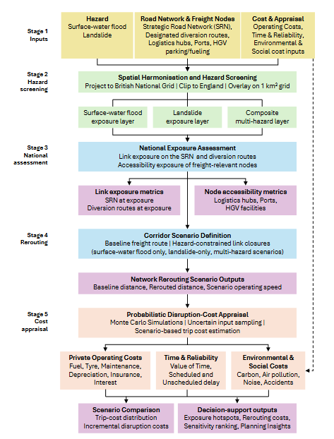
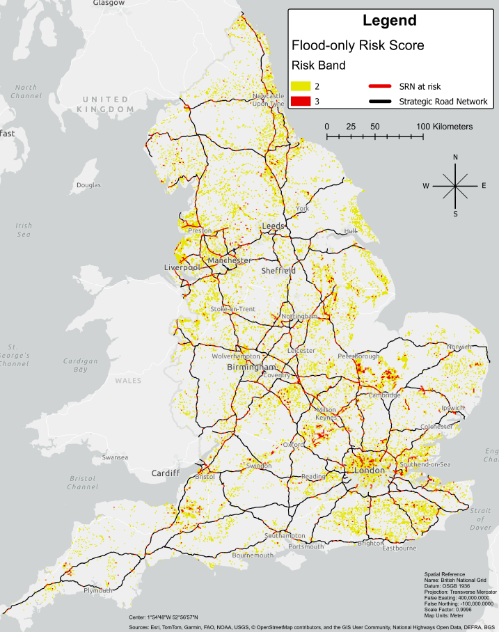
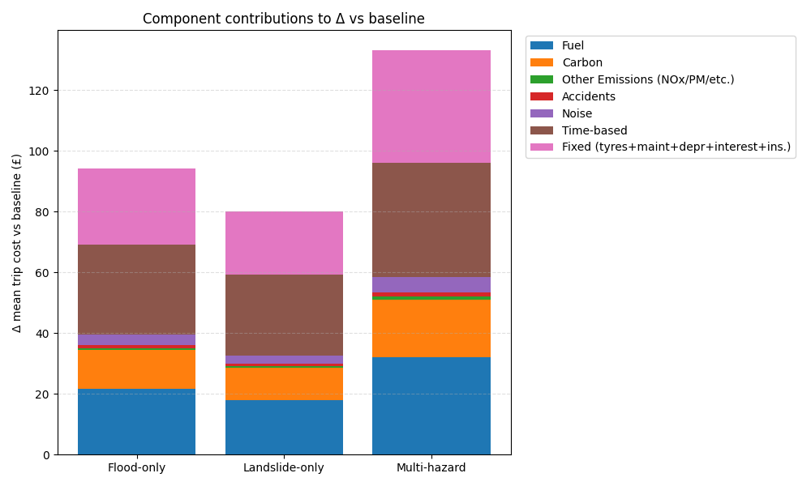

*Cover image source:*
Resilience of transportation systems [adapted from Linkov and Palma-Oliveira (2017)]

## Overview

This project develops an integrated, national-scale framework to assess the **operational resilience of road freight transport under multi-hazard conditions**, focusing on flooding and landslips across England’s Strategic Road Network (SRN). The aim is to connect **spatial hazard exposure** to **probabilistic disruption costs**, supporting risk-informed planning and resilience policy.

**Publication note:** A journal paper based on this research is in preparation for submission to Transportation Research Part D – Transport and Environment.

---

## Key Highlights

- Built a **GIS-based multi-hazard exposure framework** integrating surface-water flooding and landslip susceptibility on a uniform national grid for England
- Identified **high-exposure segments and corridors** across the SRN, diversion routes, and freight-relevant assets (e.g., nodes and logistics hubs)
- Compared **baseline vs hazard-driven rerouting** under flood-only, landslip-only, and combined multi-hazard scenarios
- Designed and implemented a **Python-based Monte Carlo cost model** to estimate total HGV disruption costs (e.g., operational, environmental, and delay-related costs for a single trip) and quantify the contribution of individual cost components, revealing time-based costs (value of time, value of delay), fuel prices, carbon pricing, and fixed operational costs (tires, maintenance, depreciation, etc.) as the dominant drivers of overall disruption impacts.
- Produced outputs designed for **decision support**, emphasizing transparency, defensible assumptions, and clear communication

---

## Methods

**1) National-scale hazard exposure mapping (GIS)**  
- Harmonized hazard layers for flooding and landslips into a consistent spatial grid
- Computed risk/exposure scores for SRN segments, diversion routes, and road freight logistics hubs

**2) Scenario-based rerouting**  
- Defined disruption “barriers” where risk clusters indicate potential closures or severe restrictions
- Generated rerouted alternatives and extracted route distances for each scenario

**3) Probabilistic disruption-cost modeling (Python / Monte Carlo)**  
- Built a simulation framework (NumPy/Pandas/SciPy/Matplotlib) to estimate cost distributions under uncertainty
- Evaluated baseline and reroute cost outcomes across multiple scenarios

---

## Figures

1. **Methodology diagram** (framework)

Figure 1 illustrates the **end-to-end analytical workflow used in this research**, from data compilation and preprocessing through hazard modeling, exposure assessment, and probabilistic impact analysis. The framework integrates single- and multi-hazard scenarios with a Monte Carlo simulation to quantify uncertainty and assess both direct and system-level impacts on freight operations.

2. **Composite risk map**

Figure 2 shows the national-scale composite (multi-hazard) risk map, derived by combining flood and landslip susceptibility scores into a unified metric. The resulting classification supports interpretation of both hazard likelihood and disruption severity, enabling identification of transport corridors potentially exposed to elevated multi-hazard risk at a national scale.

3. **Disruption cost component distribution: hazard scenarios**

Figure 3 presents a **component-wise breakdown of expected HGV trip disruption costs** derived from the Monte Carlo simulation. The results highlight which cost categories dominate total disruption impacts under hazard-induced rerouting scenarios, providing a transparent accounting of how extreme weather affects freight operations.

---

## Tools & Skills

- **GIS:** ArcGIS Pro / spatial data processing, raster & vector workflows, national-scale grid analysis  
- **Programming:** Python (NumPy, Pandas, SciPy, Matplotlib)  
- **Risk & resilience:** Multi-hazard screening, scenario design, uncertainty analysis (Monte Carlo)  
- **Communication:** Defensible methodology write-up, stakeholder-ready visualizations and summaries

---

## Access & Availability

To avoid pre-publishing the full dissertation while journal submission is in preparation, detailed methods, full results, and appendices are not posted publicly at this time.
